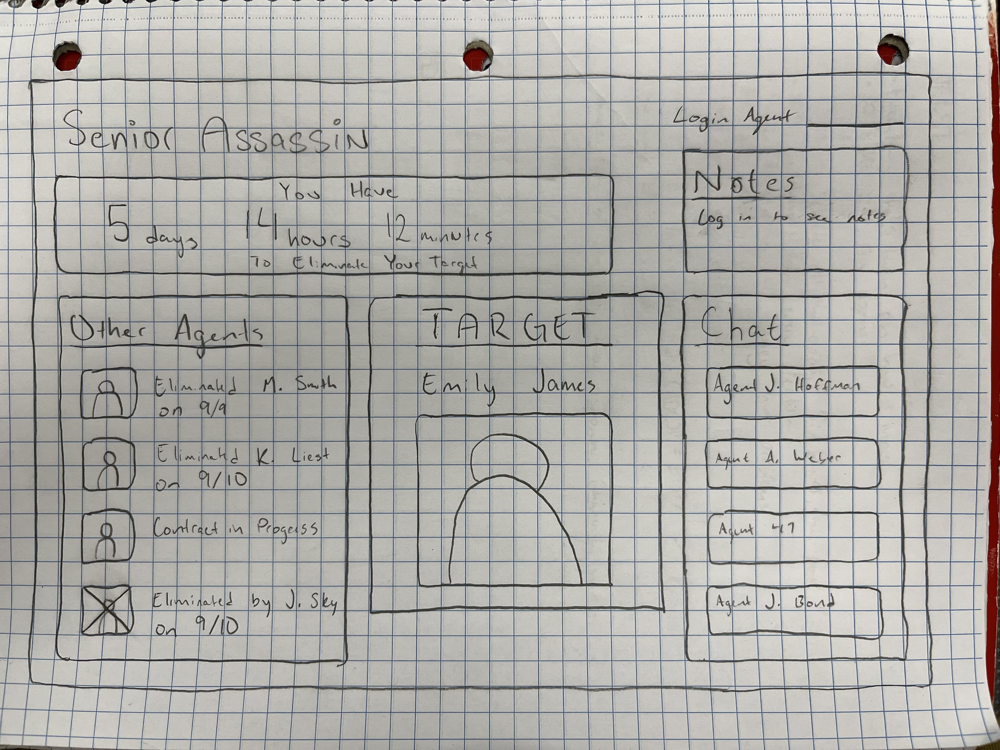

# startup2024 - Assassin

## Specification Deliverable
### Elevator Pitch
A popular event for High School seniors across the country is Senior Assassin, in which dozens of students are assigned targets among each other who they have to 'eliminate' (with nerf guns) in a certain time period (ex. a week). Whoever lasts longest without being eliminated is declared winner. Usually one or more students organizes this game themselves, taking it upon themselves to assign new targets manually each week. This application is meant to do that work for them, assigning targets and then tracking user submissions of which participants have been eliminated. 

### Design

### Key Features
* Secure login to prevent unwanted eyes seeing your target
* Leaderboard ranking "Assassins" who have eliminated their targets the quickest
* Basic chat functionality with other participants (trading information, establishing alliances, etc)
* Basic notes (which are persistently stored after leaving the application) that participants can use to keep track of information (ideas of where/when/how to get their target, suspicions of who might have _them_ as a target)
* Realtime countdown displaying either the time remaining to eliminate your target, or the time until you get a new target
* A list displaying all Assassins, stylized to show which have been eliminated and a datestamp of when they were eliminated

### Technologies
I will use the required technologies in these ways:
* **HTML -** Uses correct HTML structure for application. One page with all key features, another page for logging in. Main page only displays target and notes once logged in.
* **CSS -** Styling that works on multiple screen sizes, color and font choice that fits with the "Assassin" theme. Spacing is such that the page doesn't become too cluttered or busy when viewing.
* **React -** Allows for interactive elements like logging in, sending chats, and other stuff I haven't decided on.
* **Web Service -** Remote functions include allowing chatting with other agents, saving your elimination status, and saving notes.
* **DB/Login -** Stores login information, without which most features aren't available. Stores chats and notes.
* **WebSocket -** Renders latest Agent Statuses (who has been eliminated), displaying a realtime countdown, and displaying chats with other agents.

## HTML deliverable

For this deliverable I built out the structure of my application using HTML.

- [x] **HTML pages** - Four HTML pages: Home, Chats, Leaderboard, and Notes.
- [x] **Links** - Nav bar has links to all different pages of the website. A link can take you to a registration page. I may end up restricting certain links to after login has been completed, but haven't implemented that yet.
- [x] **Text** - Throughout the website text explains what different pages are for, placeholders, and examples of what they might display.
- [x] **Images** - Haven't created a permanent site image, but I used a random AI image to show that I know how to implement an image in HTML.
- [x] **DB/Login** - Input box and submit button for login. Created a database placeholder in leaderboard.html to show how that might be used eventually.
- [x] **WebSocket** - Created a placeholder in the chat.html page to show where that technology might be used in the future.

## CSS deliverable

For this deliverable I built the CSS to make my application LOOK pretty much like what it will in its final version.

- [x] **Header, footer, and main content body** - Structure and CSS for these elements are present on each page.
- [x] **Navigation elements** - Every page has a bootstrap navbar which is styled differently depending on what display is used.
- [x] **Responsive to window resizing** - Application looks good on both desktop and mobile (max-width: 400px) displays
- [x] **Application elements** - I chose colors, sizing, and positioning that looks good on different displays.
- [x] **Application text content** - Consistent fonts and styling.
- [x] **Application Images** - Images aren't really a part of my application but I have one image on the homepage as a placeholder for target image. This image IS styled with CSS.
